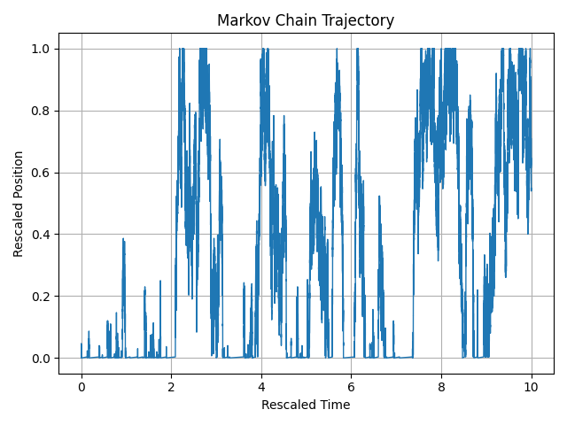
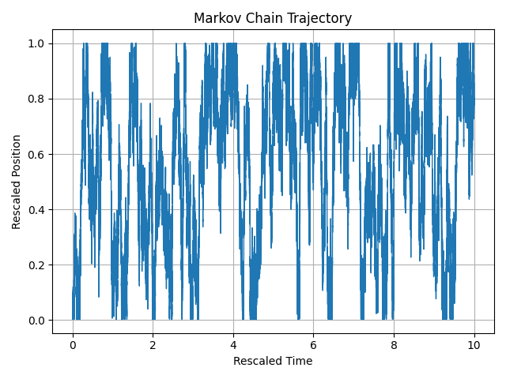

# Sticky Brownian Motion

This repository implements a discrete Markov chain approximation of a Brownian motion in $[0,1]$, with different boundary conditions at $0$, de Unde**Sticky Brownian Motion**. The discrete dynamics depends on a parameter $a$ and, under a diffusive rescaling, for some choice of the parameter, the limiting Brownian motion is a **Sticky Brownian** at $0$. Other boundary behaviours at $0$, depending on $a$, show up. 

---

## State Space

We consider the discrete state space
\[
\{0, \tfrac{1}{N}, \tfrac{2}{N}, \dots, 1\},
\]
where the chain moves between adjacent points.

For implementation purposes, the states are indexed as integers:
\[
\{0, 1, 2, \dots, N\},
\]
with state \(k\) corresponding to \(k/N\).

---

## Transition Rates

- **Interior states** (\(k = 1, \dots, N-1\), corresponding to \(1/N, \dots, 1-1/N\)):  
  The jump rates are symmetric with value **1** for moving left or right.

- **Left boundary at 0**:
  - From \(0 \to 1/N\): rate \(N^{a-1}\).
  - From \(1/N \to 0\): rate \(N^{a}\).

- **Right boundary at 1**:  
  - From \(1 \to 1 - 1/N\): rate **1**.  
  (This boundary is less interesting since it behaves like a reflecting boundary.)

---

## Invariant Measure

Since the chain is a **birth-death process**, we can compute its invariant distribution \(\pi\) using detailed balance.

For interior states:
\[
\pi(k+1)/\pi(k) = 1/1 = 1 \quad \implies \quad \pi(k) \; \text{constant for } k=1,\dots,N.
\]

At the left boundary:
\[
\frac{\pi(1)}{\pi(0)} = \frac{N^{a-1}}{N^a} = \frac{1}{N}.
\]

At the right boundary:
\[
\pi(N)/\pi(N-1) = 1.
\]

Thus:
\[
\pi(0) \propto N, \qquad \pi(k) \propto 1 \quad (k=1,\dots,N).
\]

Normalizing:
\[
Z = N + N = 2N,
\]
so
\[
\pi(0) = \tfrac{1}{2}, \qquad \pi(k) = \tfrac{1}{2N}, \quad k=1,\dots,N.
\]

---

## Scaling Limits

The aim is to analyze the **diffusive scaling limit** of the process as \(N \to \infty\).  
Depending on the value of the parameter \(a\), we observe different limiting behaviors at the left boundary:

- **Case \(a > -1\)**:  
  The process converges to **Brownian motion with a sticky boundary condition at 0** and reflecting at 1.

- **Case \(a < -1\)**:  
  Both boundaries become **reflecting** in the limit.

- **Case \(a = -1\)**:  
  An intermediate regime where the particle spends an **exponential amount of time at the origin** before resuming Brownian motion.

---

## Figures

We illustrate the three regimes below:

- **Sticky boundary at 0 (\(a > -1\))**  
  

- **Reflecting boundaries (\(a < -1\))**  
  

- **Intermediate regime (\(a = -1\))**  
  

*(Add the actual figures in a `/figures` folder and update the filenames above.)*

---
