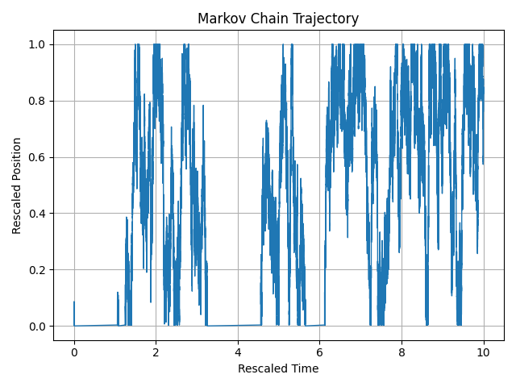

Page's link: [View on GitHub Pages](https://alessandrogubbiotti.github.io/Sticky-Brownian-Motion/)

# Sticky Brownian Motion

This repository implements a discrete Markov chain approximation of a Brownian motion in $[0,1]$, with different boundary conditions at $0$. The discrete dynamics depends on a parameter $a$ and, under a diffusive rescaling, for some choice of the parameter, the limiting Brownian motion is a **Sticky Brownian** at $0$. Other boundary behaviours at $0$, depending on $a$, show up. 

---

## State Space

We consider the discrete state space  

  

For implementation purposes, the states are indexed as integers:  

  

---

## Transition Rates

- **Interior states** At the interior states $ 1/N, \dots, 1-1/N$, the jump rates are symmetric with value **1** for moving left or right.

- **Left boundary at 0**:
  - Transition $0 \to 1/N$: rate $N^{a-1}$.
  - Transition $1/N \to 0$: rate $N^{a}$.

- **Right boundary at 1**:  
  - Transition $1 \to 1 - 1/N$: rate **1**.  
  (This boundary is less interesting since it behaves like a reflecting boundary.)

---

## Invariant Measure

=\tfrac{1}{2},\;\pi(k)=\tfrac{1}{2N},\;k=1,...,N)  

---

## Scaling Limits

The aim is to analyze the **diffusive scaling limit** of the process as $N \to \infty$.  
Depending on the value of the parameter $a$, we observe different limiting behaviors at the left boundary:

- **Case $a > -1$**:  
  The process converges to **Brownian motion with a sticky boundary condition at 0** and reflecting at 1.

- **Case $a < -1$**:  
  Both boundaries become **reflecting** in the limit.

- **Case $a = -1$**:  
  An intermediate regime where the particle spends an **exponential amount of time at the origin** before resuming Brownian motion.

---

## Figures

- **Sticky boundary at 0 $(a > -1)$**  
  

- **Reflecting boundaries $(a < -1)$**  
  

- **Intermediate regime $(a = -1)$**  
  

